# Pyramid of Pain: Detection Engineering Lab (TryHackMe)

## Overview

This project documents my work on the TryHackMe **Pyramid of Pain** room. In the lab, I act as a defender at a fictional company (PicoSecure) while a pentester called **Sphinx** runs six malware samples against a simulated compromised user account. Each time I block a sample, Sphinx changes something and sends a harder one.

The goal is to detect malware at higher and higher levels of the Pyramid of Pain, so that each block costs the attacker more effort than the last. I analyzed the sandbox report or logs for every sample, chose the indicator to target, and built the matching detection or blocking rule.

> **Note:** This is a training lab with simulated malware and a simulated environment. It is not a production system.

## The Pyramid of Pain

The Pyramid of Pain ranks indicators of compromise (IOCs) by how much it hurts the attacker when defenders detect and block them. Low-level indicators are easy for an attacker to change. High-level indicators force them to change their tools and habits.

| Level | Indicator | Effort for the attacker to change it |
|---|---|---|
| 1 | Hash values | Trivial |
| 2 | IP addresses | Easy |
| 3 | Domain names | Simple |
| 4 | Host/network artifacts | Annoying |
| 5 | Tools | Challenging |
| 6 | TTPs (tactics, techniques and procedures) | Tough |

## Results at a Glance

| Sample | Pyramid level | What I detected or blocked | Rule type | MITRE ATT&CK |
|---|---|---|---|---|
| 1 | Hash values | SHA1 hash of `sample1.exe` | Hash blocklist | n/a |
| 2 | IP addresses | C2 server `154.35.10.113` | Firewall rule (egress deny) | n/a |
| 3 | Domain names | C2 domain `emudyn.bresonicz.info` | DNS rule (deny) | n/a |
| 4 | Host artifacts | Registry change disabling Windows Defender real-time monitoring | Sysmon registry rule | Defense Evasion (TA0005) |
| 5 | Tools / behavior | Beaconing pattern: 97 bytes every 1800 seconds | Sysmon network connection rule | Command and Control (TA0011) |
| 6 | TTPs | Discovery output staged in `%temp%\exfiltr8.log` | Sysmon file creation rule | Collection (TA0009) |

## Walkthrough

### Sample 1: Hash values

**Scenario:** `sample1.exe` is a 202.5 KB Windows executable. The Malware Sandbox tagged it as `Trojan.Metasploit.A`, flagged Metasploit as malicious, and showed a connection to an unusual port.

**Action:** I copied the SHA1 hash from the sandbox report and added it to the Hash Blocklist in the IOC Management panel. The platform confirmed that the sample was prevented from executing.

**Why it is weak:** A hash identifies one exact file. Changing a single bit produces a new hash, so the attacker can get around this block almost for free. Sphinx did exactly that by recompiling the malware for the next sample.

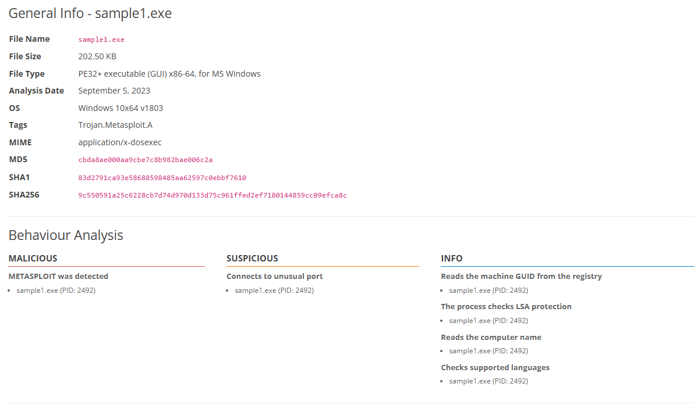
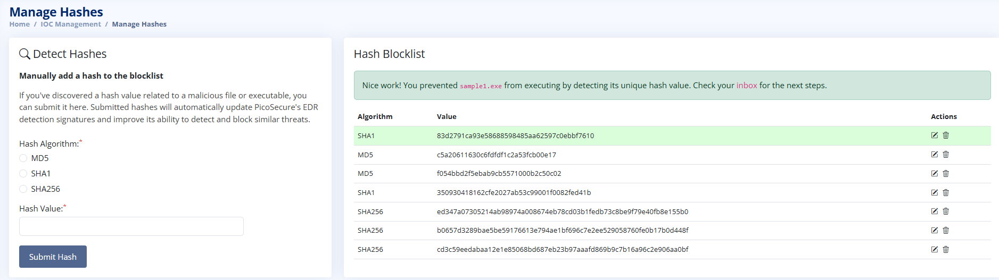

### Sample 2: IP addresses

**Scenario:** `sample2.exe` had a new hash, so my hash rule no longer matched. The sandbox report showed it making an HTTP GET request to `154.35.10.113` on port `4444`, its command-and-control (C2) server.

**Action:** I created a rule in the Firewall Rule Manager that denies egress (outgoing) traffic to `154.35.10.113`. The platform confirmed that the malware could no longer reach the C2 server.

**Why it is weak:** The attacker only needs a new public IP address, which is cheap to get from a cloud provider.

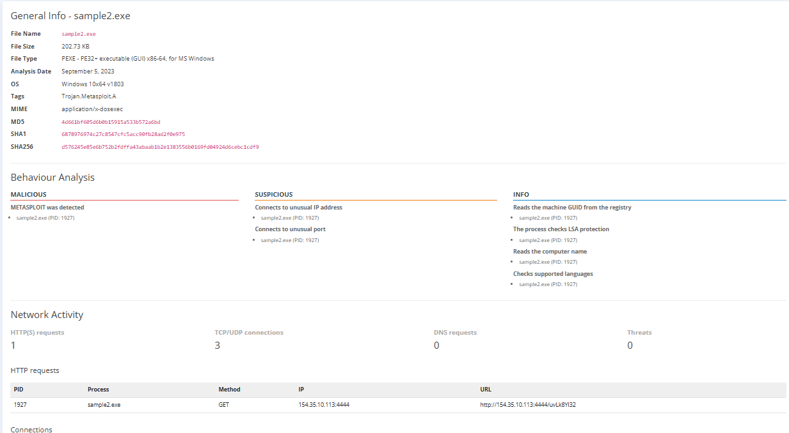
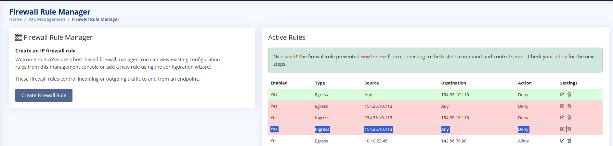

### Sample 3: Domain names

**Scenario:** Sphinx moved to a new IP address. The report for `sample3.exe` showed DNS and HTTP requests to `emudyn.bresonicz.info`, and the sample also downloaded a second-stage file called `backdoor.exe`.

**Action:** I created a rule in the DNS Rule Manager with the category Malware and the action Deny for `emudyn.bresonicz.info`. Denying a domain also covers its subdomains. The platform confirmed that the DNS filter stopped the sample from reaching its C2 server.

**Why it is better:** The attacker can change IPs freely, but the domain stays the same. To get around this rule he has to buy and register new domains and change DNS records.

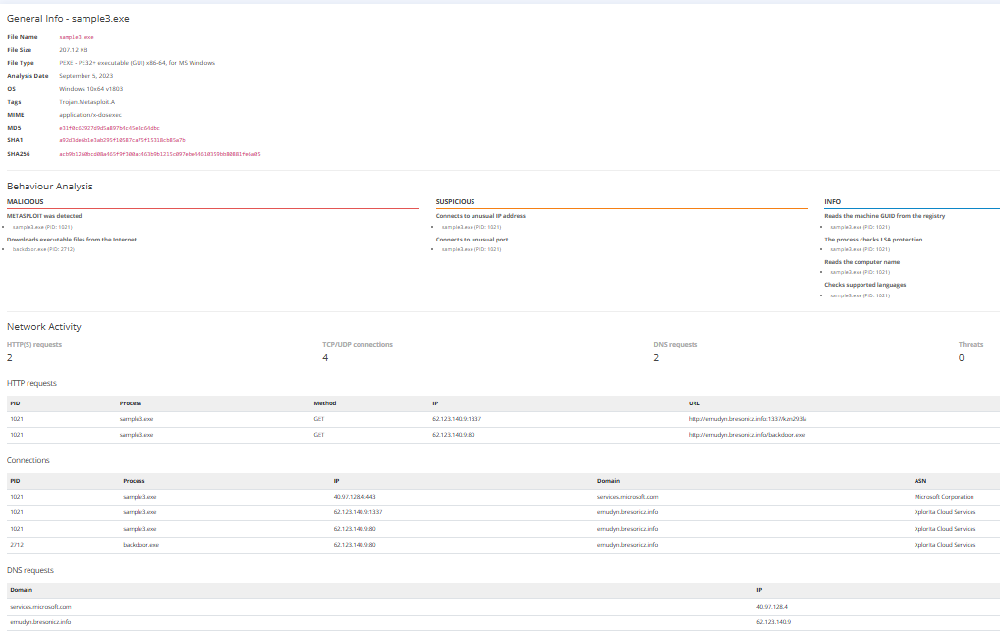
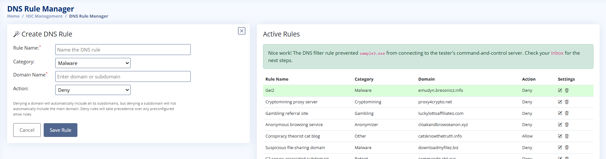

### Sample 4: Host artifacts

**Scenario:** Blocking hashes, IPs and domains no longer helped, so I looked at what the malware changes on the victim host. The Registry Activity section of the `sample4.exe` report showed it writing to the registry to disable Windows Defender real-time monitoring.

**Action:** I created a Sysmon registry-modification rule:

- **Key:** `HKEY_LOCAL_MACHINE\SOFTWARE\Microsoft\Windows Defender\Real-Time Protection`
- **Name:** `DisableRealtimeMonitoring`
- **Value:** `1`
- **MITRE ATT&CK:** Defense Evasion (TA0005)

**Why it is better:** I stopped looking at the attacker's infrastructure and started looking at the effect of his malware on the host. These traces are much harder to disguise.

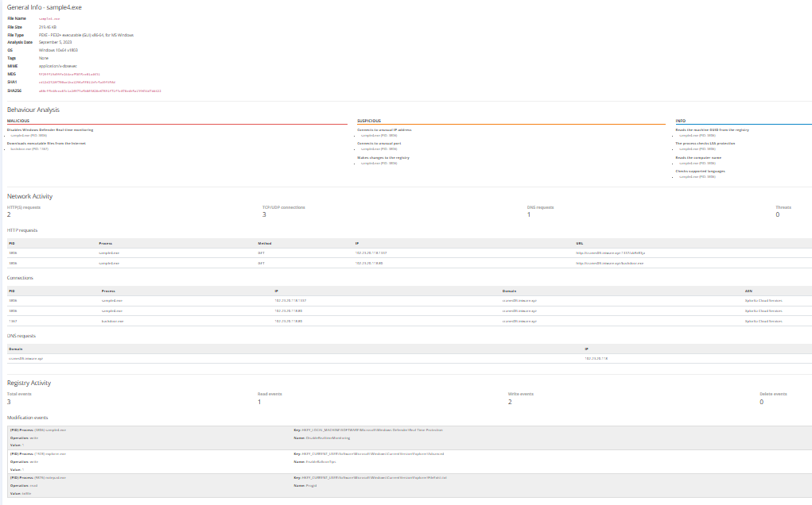
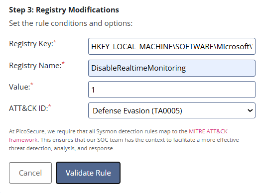

### Sample 5: Tools and network behavior

**Scenario:** Sphinx switched to a tool where the heavy lifting happens on his back-end server, so there were no useful host artifacts. He provided `outgoing_connections.log` from the infected host (`10.10.15.12`). Most connections were varied and irregular, but one repeated: `51.102.10.19` on port `443`, always **97 bytes**, about every **30 minutes**. This is beaconing, a regular check-in to a C2 server.

**Action:** I created a Sysmon network connection rule:

- **Remote IP / Port:** Any / Any
- **Size:** 97 bytes
- **Frequency:** 1800 seconds
- **MITRE ATT&CK:** Command and Control (TA0011)

Sphinx's next email confirmed that `sample5.exe` was detected.

**Why it is better:** The rule matches the rhythm of the tool instead of its address. He can change IPs and domains easily, but to change this behavior he has to build or learn a completely new tool.

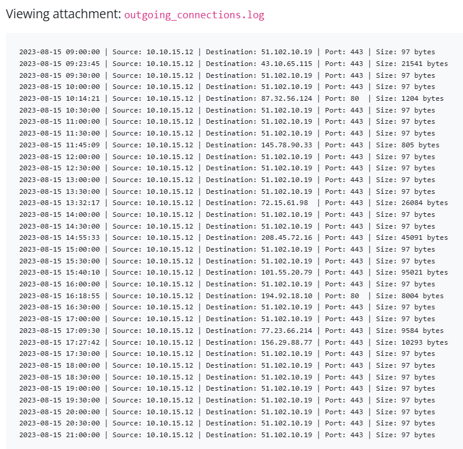
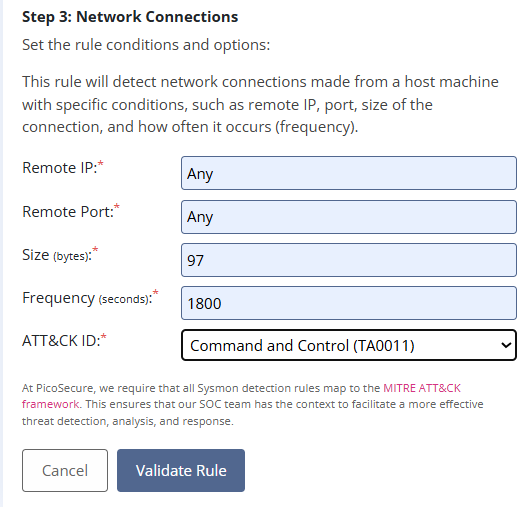

### Sample 6: TTPs

**Scenario:** For the last sample, Sphinx provided `commands.log`, which shows what his malware does after it gets access. These are discovery commands, with every output redirected to `%temp%\exfiltr8.log`:

```
dir c:\ >> %temp%\exfiltr8.log
net localgroup administrator >> %temp%\exfiltr8.log
systeminfo >> %temp%\exfiltr8.log
ipconfig /all >> %temp%\exfiltr8.log
netstat -ano >> %temp%\exfiltr8.log
net start >> %temp%\exfiltr8.log
```

The sandbox process tree agrees: `sample6.exe` runs from the user's Temp folder, is launched from `explorer.exe`, and spawns `cmd.exe` three times, one of which drops `exfiltr8.log`.

**Action:** I created a Sysmon file creation and modification rule:

- **Path:** `%temp%`
- **File name:** `exfiltr8.log`
- **MITRE ATT&CK:** Collection (TA0009)

**Why it is the hardest to evade:** TTPs describe how an attacker works: which commands he runs and how he collects and stages data. That is much harder to change than a hash, IP, domain or single tool.

**Limitation:** A fixed file name is easy for an attacker to rename. In a real environment, I would also detect the command sequence and the parent-child process behavior (`sample6.exe` spawning multiple `cmd.exe` processes) instead of relying on one file name.

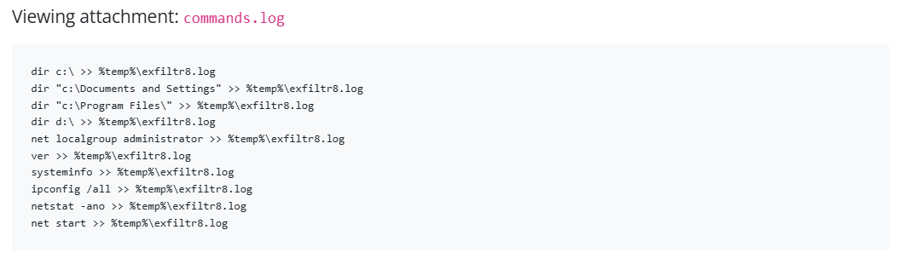
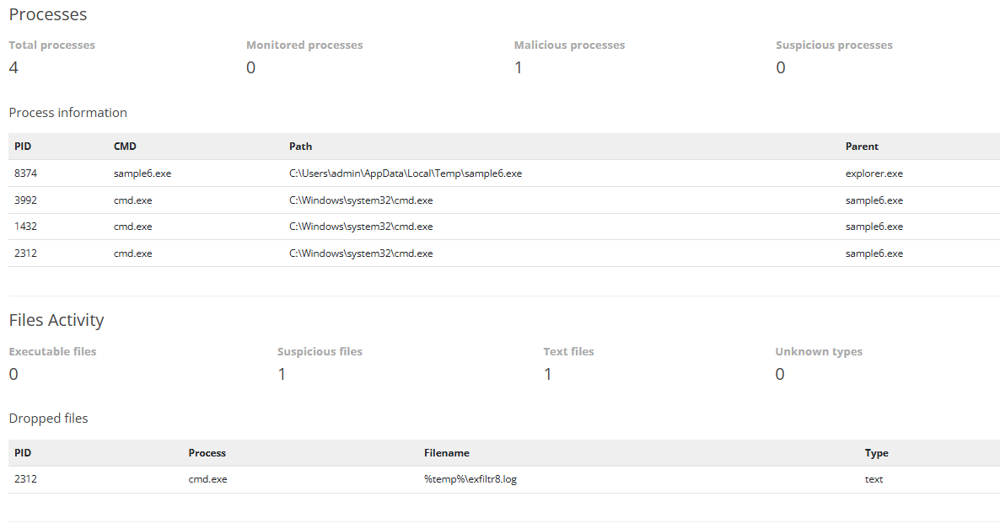
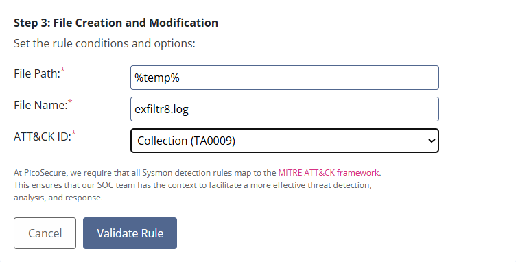

## Key Takeaways

- Blocking low-level indicators (hashes, IPs, domains) is fast and precise, but the attacker can replace them quickly and cheaply.
- Detections that target behavior (host artifacts, beaconing patterns, TTPs) are more durable because the attacker has to rebuild tools and change habits.
- Sandbox reports and network logs are only useful if you know what to look for: registry changes, repeated connection sizes and intervals, and staged output files.
- Every detection should be mapped to MITRE ATT&CK so the SOC has context for triage and response.

## Skills Demonstrated

- Malware sandbox report analysis
- IOC identification and management (hashes, IPs, domains)
- Firewall and DNS filtering rules
- Sysmon detection rules for registry, network and file activity
- Beaconing detection from network logs
- MITRE ATT&CK mapping
- Applying the Pyramid of Pain to prioritize detections

## Tools and Platform

- [TryHackMe: Pyramid of Pain](https://tryhackme.com/) lab environment
- Malware Sandbox and the PicoSecure IOC management console (hash, firewall and DNS rule managers)
- Sysmon-based detection rule builder

## Disclaimer

This repository documents an educational lab. All malware samples, IP addresses, domains and organizations in the screenshots are part of a simulated TryHackMe scenario.
